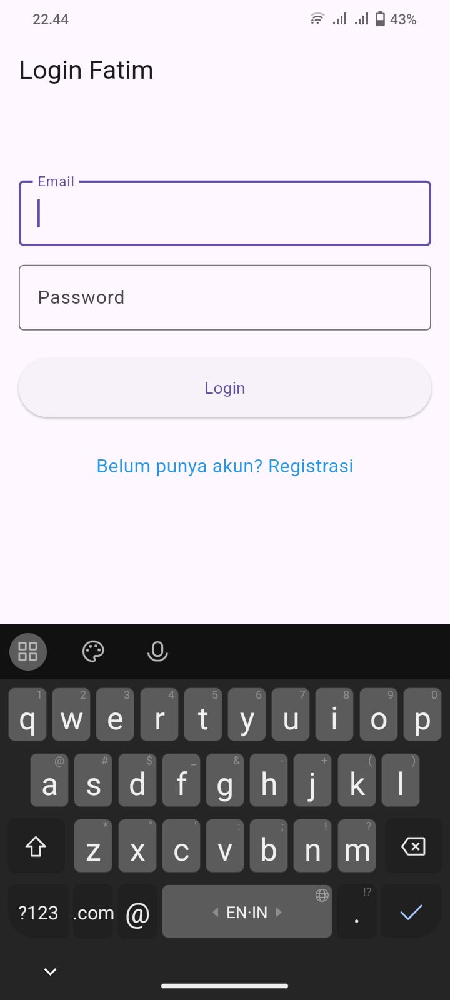
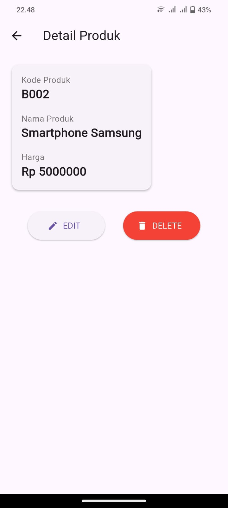
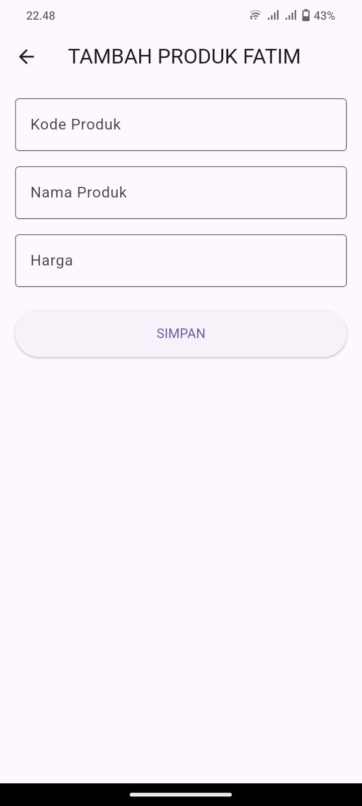
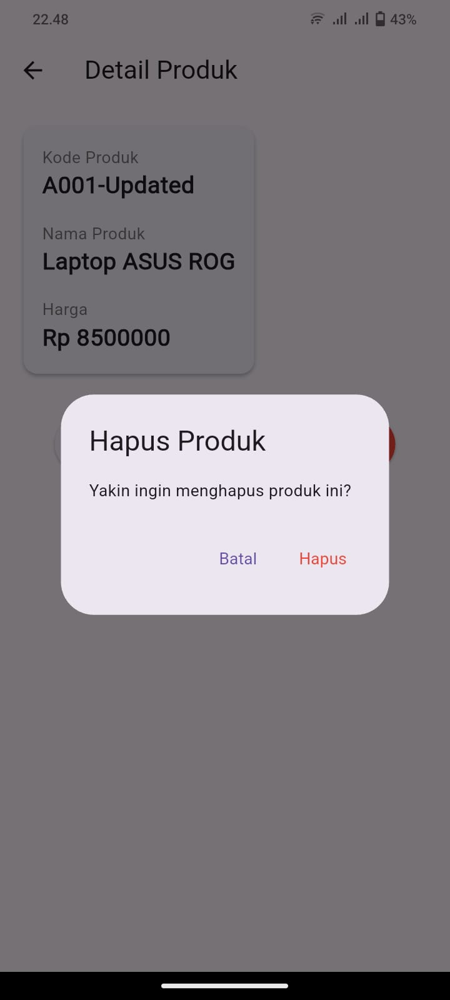

##  Tugas 8 Flutter -  CRUD

### Nama : Fatimah Nurmawati
### NIM : H1D023019
### Shift: C
  
Aplikasi mengimplementasikan:

-  **Authentication** - Login dan Registrasi pengguna
-  **CRUD Produk** - Tambah, Lihat, Edit, Hapus produk
-  **Responsive Design** - Tampilan yang optimal di berbagai device
-  **Modern UI** - Interface yang user-friendly

---

## Struktur Project

```
lib/
├── model/
│ ├── login.dart
│ ├── registrasi.dart
│ └── produk.dart
├── ui/
│ ├── login_page.dart
│ ├── registrasi_page.dart
│ ├── produk_page.dart
│ ├── produk_form.dart
│ └── produk_detail.dart
├── services/
│ └── api_service.dart
└── main.dart
```

---

## Penjelasan Kode

#### **1. Halaman Login**
Halaman ini digunakan untuk login ke aplikasi. Pengguna memasukkan email dan password, kemudian aplikasi akan memvalidasi input sebelum melakukan proses login.

Komponen kode utama:

a. GlobalKey<FormState> untuk mengelola state form dan validasi

b. TextEditingController untuk mengontrol input field email dan password

c.  Validasi email menggunakan regex pattern untuk memastikan format email benar

d.  Validasi password memastikan field tidak kosong

e. _isLoading state untuk menampilkan loading indicator selama proses login

f.  Setelah login berhasil, navigasi ke halaman List Produk menggunakan Navigator.pushReplacement

#### **2. Halaman Registrasi**
Halaman ini digunakan untuk membuat akun baru. Pengguna mengisi nama, email, password, dan konfirmasi password. Form memvalidasi semua field sebelum melakukan registrasi.

Komponen kode utama:

a.  Validasi nama: minimal 3 karakter

b. Validasi email: format email harus valid menggunakan regex pattern

c.  Validasi password: minimal 6 karakter

d. Validasi konfirmasi password: harus sama dengan password

e.  SnackBar untuk menampilkan feedback hasil registrasi

f. Setelah registrasi berhasil, navigasi kembali ke halaman login

#### **3. List Produk**
Halaman ini menampilkan daftar semua produk yang tersimpan. Pengguna dapat mengetuk produk untuk melihat detail, atau menambah produk baru menggunakan ikon '+' di app bar.

Komponen kode utama:

a.  ListView.builder untuk menampilkan data produk secara efisien

b. Data produk disimpan dalam List<Produk> untuk management state

c. Setiap item menggunakan ListTile dengan icon, nama produk, dan harga

d. Navigator.push untuk navigasi ke halaman detail ketika produk diklik

e.  Navigator.push untuk navigasi ke halaman form ketika tombol '+' diklik

#### **4. Halaman Detail Produk**
Halaman ini menunjukkan informasi detail tentang produk yang dipilih, termasuk kode, nama, dan harga. Pengguna dapat mengedit atau menghapus produk dari halaman ini.

Komponen kode utama:

a. Menerima data produk melalui constructor parameter

b.  Menampilkan detail produk dalam layout Card dengan styling yang jelas

c.  Widget _tombolHapusEdit() dengan tombol Edit dan Delete

d.  Tombol Edit menavigasi ke ProdukForm dengan data produk yang ada

e.  Tombol Delete menampilkan AlertDialog konfirmasi sebelum menghapus

f. Setelah hapus berhasil, menampilkan SnackBar dan navigasi kembali ke list produk

#### **4. Form Tambah Produk**
Halaman ini digunakan untuk menambah produk baru. Pengguna mengisi kode produk, nama, dan harga. Form memvalidasi bahwa semua field diisi sebelum menyimpan.

Komponen kode utama:

a. Judul dinamis "TAMBAH PRODUK FATIM" dan tombol "SIMPAN"

b. TextFormField untuk kode produk, nama produk, dan harga

c.  Keyboard numerik untuk input field harga

d. Validasi memastikan semua field tidak kosong

e.  _isLoading state untuk menampilkan loading indicator selama proses simpan

f.  Setelah simpan berhasil, menampilkan SnackBar dan navigasi kembali

#### **4. Form Edit Produk**
Halaman ini digunakan untuk mengedit produk yang ada. Form diisi sebelumnya dengan data produk saat ini. Pengguna dapat memodifikasi field dan menyimpan perubahan.

Komponen kode utama:

a. Constructor menerima parameter Produk? produk untuk menentukan mode edit/tambah

b. initState() mengisi TextEditingController dengan data existing untuk mode edit

c. Judul dinamis "UBAH PRODUK FATIM" dan tombol "UBAH"

d. Logika validasi dan penyimpanan sama dengan form tambah

e. Setelah update berhasil, menampilkan SnackBar dan navigasi kembali

---

### Screenshot Aplikasi
| Login                     | Produk_page                 | Detail_page                 |
|---------------------------|-----------------------------|-----------------------------|
| | | |
---
| Form Create                 | Form Edit                      | Delete Produk               |
|-----------------------------|--------------------------------|-----------------------------|
| | | |