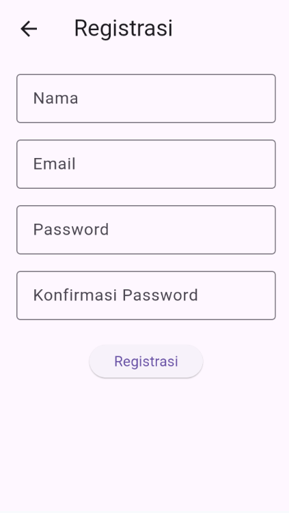
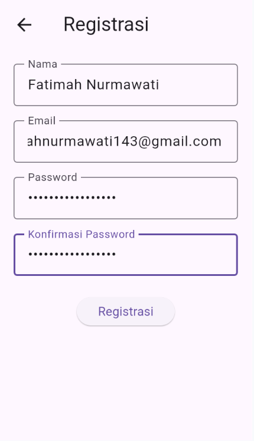
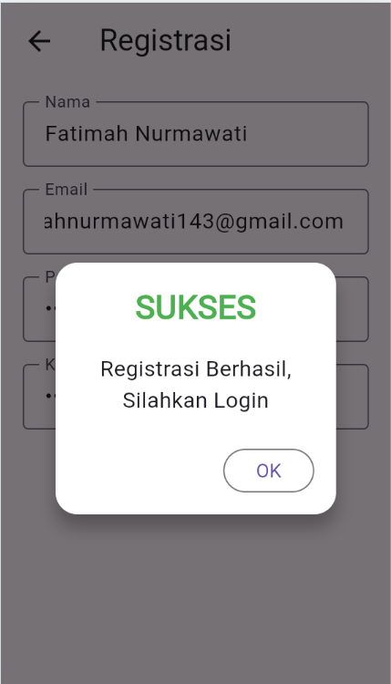

##  Tugas 9 - TOKOKITA

### Nama : Fatimah Nurmawati
### NIM : H1D023019
### Shift: C
  
## Aplikasi mengimplementasikan:

- **Registrasi Member**: Pendaftaran akun baru.
- **Login & Logout**: Autentikasi aman menggunakan Token.
- **List Produk**: Menampilkan daftar produk dari database.
- **Tambah Produk**: Menambahkan data produk baru.
- **Edit Produk**: Mengedit informasi produk.
- **Detail Produk**: Melihat rincian lengkap produk.
- **Hapus Produk**: Menghapus produk yang tidak diinginkan.

---

## Struktur Project

```
lib/
├── bloc/                   
│   ├── registrasi_bloc.dart
│   ├── login_bloc.dart
│   ├── produk_bloc.dart
│   └── logout_bloc.dart
├── helpers/               
│   ├── api.dart           
│   ├── api_url.dart       
│   ├── user_info.dart    
│   └── app_exception.dart 
├── model/              
│   ├── registrasi.dart
│   ├── login.dart
│   └── produk.dart
├── ui/                   
│   ├── registrasi_page.dart
│   ├── login_page.dart
│   ├── produk_page.dart
│   ├── produk_form.dart
│   └── produk_detail.dart
├── widget/               
│   ├── success_dialog.dart
│   └── warning_dialog.dart
└── main.dart            
```

---

## Alur Kerja Aplikasi 

#### **1. Registrasi**
| Form Regist (Kosong)     | Form Regist (isi)          | Pop Up berhasil regist     |
|--------------------------|----------------------------|----------------------------|
||||

Pengguna mengisi form registrasi dengan nama, email, dan password. Sistem melakukan validasi seperti format email dan panjang password. Setelah validasi berhasil, data dikirim ke endpoint /registrasi untuk disimpan di database.

**Kode Validasi Email (`lib/ui/registrasi_page.dart`):**
```dart
Widget _emailTextField() {
  return TextFormField(
    decoration: const InputDecoration(labelText: "Email"),
    keyboardType: TextInputType.emailAddress,
    controller: _emailTextboxController,
    validator: (value) {
      if (value!.isEmpty) {
        return 'Email harus diisi';
      }
      Pattern pattern =
          r'^(([^<>()[\]\\.,;:\s@\"]+(\.[^<>()[\]\\.,;:\s@\"]+)*)|(\".+\"))@((\[[0-9]{1,3}\.[0-9]{1,3}\.[0-9]{1,3}\.[0-9]{1,3}\])|(([a-zA-Z\-0-9]+\.)+[a-zA-Z]{2,}))$';
      RegExp regex = RegExp(pattern.toString());
      if (!regex.hasMatch(value)) {
        return "Email tidak valid";
      }
      return null;
    },
  );
}
```

**Kode BLoC Registrasi (`lib/bloc/registrasi_bloc.dart`):**
```dart
class RegistrasiBloc {
  static Future<Registrasi> registrasi(
      {String? nama, String? email, String? password}) async {
    
    String apiUrl = ApiUrl.registrasi;
    var body = {"nama": nama, "email": email, "password": password};
    var response = await Api().post(apiUrl, body);
    var jsonObj = json.decode(response.body);
    return Registrasi.fromJson(jsonObj);
  }
}
```

