##  Tugas 9 - TOKOKITA

### Nama : Fatimah Nurmawati
### NIM : H1D023019
### Shift: C
  
## Aplikasi mengimplementasikan:

- **Registrasi Member**: Pendaftaran akun baru.
- **Login & Logout**: Autentikasi aman menggunakan Token.
- **List Produk**: Menampilkan daftar produk dari database.
- **Tambah Produk**: Menambahkan data produk baru.
- **Edit Produk**: Mengedit informasi produk.
- **Detail Produk**: Melihat rincian lengkap produk.
- **Hapus Produk**: Menghapus produk yang tidak diinginkan.

---

## Struktur Project

```
lib/
├── bloc/                   
│   ├── registrasi_bloc.dart
│   ├── login_bloc.dart
│   ├── produk_bloc.dart
│   └── logout_bloc.dart
├── helpers/               
│   ├── api.dart           
│   ├── api_url.dart       
│   ├── user_info.dart    
│   └── app_exception.dart 
├── model/              
│   ├── registrasi.dart
│   ├── login.dart
│   └── produk.dart
├── ui/                   
│   ├── registrasi_page.dart
│   ├── login_page.dart
│   ├── produk_page.dart
│   ├── produk_form.dart
│   └── produk_detail.dart
├── widget/               
│   ├── success_dialog.dart
│   └── warning_dialog.dart
└── main.dart            
```

---

## Alur Kerja Aplikasi 

#### **1. Registrasi**
| Form Regist (Kosong)     | Form Regist (isi)          | Pop Up berhasil regist     |
|--------------------------|----------------------------|----------------------------|
||||

Pengguna mengisi form registrasi dengan nama, email, dan password. Sistem melakukan validasi seperti format email dan panjang password. Setelah validasi berhasil, data dikirim ke endpoint /registrasi untuk disimpan di database.

**Kode Validasi Email (`lib/ui/registrasi_page.dart`):**
```dart
Widget _emailTextField() {
  return TextFormField(
    decoration: const InputDecoration(labelText: "Email"),
    keyboardType: TextInputType.emailAddress,
    controller: _emailTextboxController,
    validator: (value) {
      if (value!.isEmpty) {
        return 'Email harus diisi';
      }
      Pattern pattern =
          r'^(([^<>()[\]\\.,;:\s@\"]+(\.[^<>()[\]\\.,;:\s@\"]+)*)|(\".+\"))@((\[[0-9]{1,3}\.[0-9]{1,3}\.[0-9]{1,3}\.[0-9]{1,3}\])|(([a-zA-Z\-0-9]+\.)+[a-zA-Z]{2,}))$';
      RegExp regex = RegExp(pattern.toString());
      if (!regex.hasMatch(value)) {
        return "Email tidak valid";
      }
      return null;
    },
  );
}
```

**Kode BLoC Registrasi (`lib/bloc/registrasi_bloc.dart`):**
```dart
class RegistrasiBloc {
  static Future<Registrasi> registrasi(
      {String? nama, String? email, String? password}) async {
    
    String apiUrl = ApiUrl.registrasi;
    var body = {"nama": nama, "email": email, "password": password};
    var response = await Api().post(apiUrl, body);
    var jsonObj = json.decode(response.body);
    return Registrasi.fromJson(jsonObj);
  }
}
```

#### **2. Login**
| Form Login (Kosong)     | Form Login (isi)          | Pop Up berhasil login     |
|--------------------------|----------------------------|----------------------------|
|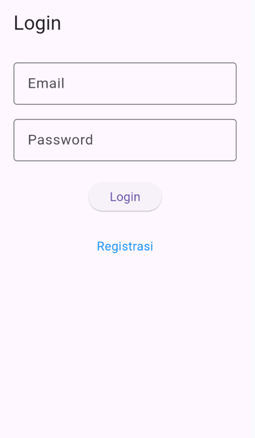|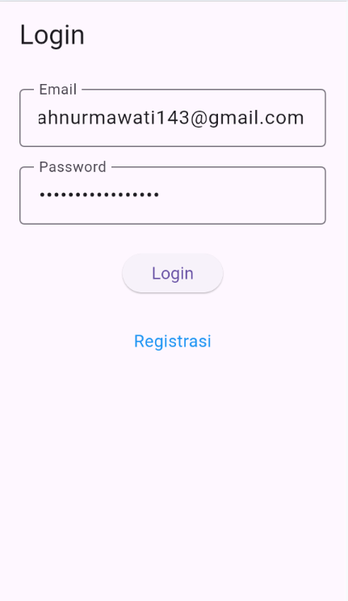|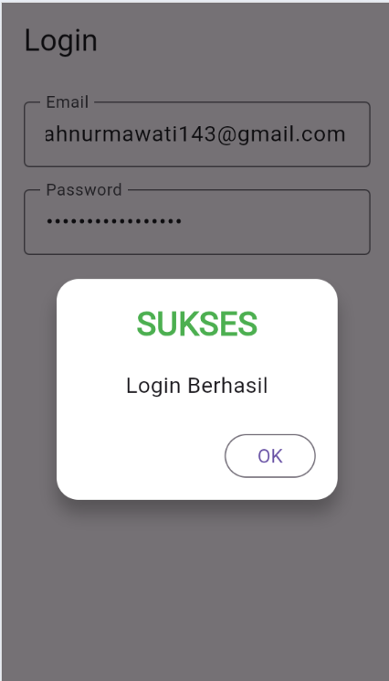|

Pengguna memasukkan email dan password yang telah terdaftar. Sistem mengirim permintaan ke endpoint /login untuk verifikasi. Jika berhasil, server mengembalikan token autentikasi yang kemudian disimpan secara lokal menggunakan SharedPreferences.

**Kode Penyimpanan Token (`lib/ui/login_page.dart`):**
```dart
void _submit() {
  _formKey.currentState!.save();
  setState(() {
    _isLoading = true;
  });
  
  LoginBloc.login(
    email: _emailTextboxController.text,
    password: _passwordTextboxController.text)
  .then((value) async {
    if (value.code == 200) {
      await UserInfo().setToken(value.token.toString());
      await UserInfo().setUserID(int.parse(value.userID.toString()));
      Navigator.pushReplacement(context,
        MaterialPageRoute(builder: (context) => const ProdukPage()));
    } else {
      showDialog(
        context: context,
        builder: (BuildContext context) => const WarningDialog(
          description: "Login gagal, silahkan coba lagi",
        ),
      );
    }
  });
}
```

**Kode Model Login (`lib/model/login.dart`):**
```dart
class Login {
  int? code;
  bool? status;
  String? token;
  int? userID;
  String? userEmail;
  
  Login([this.code, this.status, this.token, this.userID, this.userEmail]);
  
  factory Login.fromJson(Map<String, dynamic> obj) {
    if (obj['code'] == 200) {
      return Login(
        code: obj['code'],
        status: obj['status'],
        token: obj['data']['token'],
        userID: int.parse(obj['data']['user']['id']),
        userEmail: obj['data']['user']['email'],
      );
    } else {
      return Login(
        code: obj['code'],
        status: obj['status'],
      );
    }
  }
}
```

#### **3. Menampilkan List Produk**
| List Produk      |
|--------------------------|
|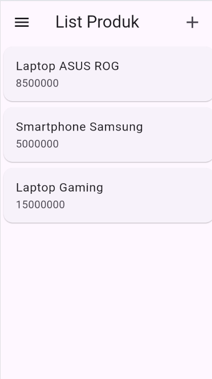|

Aplikasi mengambil data produk dari endpoint /produk menggunakan metode GET. Response JSON di-parsing menjadi objek Produk dan ditampilkan dalam ListView.builder. Setiap item produk dapat diklik untuk melihat detail.

**Kode BLoC Get Produk (`lib/bloc/produk_bloc.dart`):**
```dart
static Future<List<Produk>> getProduks() async {
  String apiUrl = ApiUrl.listProduk;
  var response = await Api().get(apiUrl);
  var jsonObj = json.decode(response.body);
  
  List<dynamic> listProduk = (jsonObj as Map<String, dynamic>)['data'];
  List<Produk> produks = [];
  
  for (int i = 0; i < listProduk.length; i++) {
    produks.add(Produk.fromJson(listProduk[i]));
  }
  
  return produks;
}
```

**Kode Tampilan List (`lib/ui/produk_page.dart`):**
```dart
body: Center(
  child: FutureBuilder<List<Produk>>(
    future: ProdukBloc.getProduks(),
    builder: (context, snapshot) {
      if (snapshot.hasError) print(snapshot.error);
      return snapshot.hasData
          ? ListProduk(list: snapshot.data)
          : const CircularProgressIndicator();
    },
  ),
),
```

#### **4. Create Produk**
| Form Create (Kosong)     | Form Create (isi)          | List Produk     |
|--------------------------|----------------------------|----------------------------|
|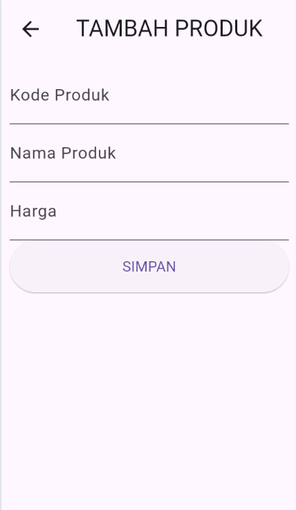|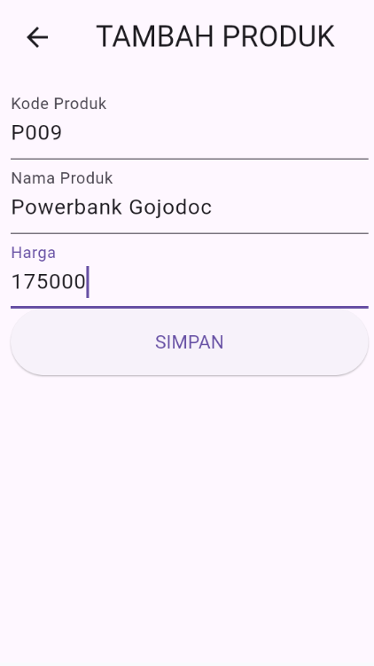|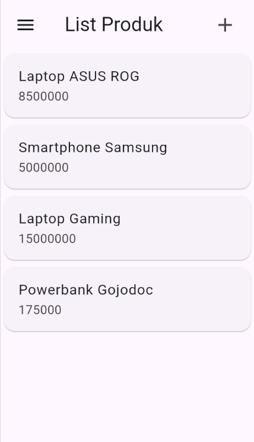|

Form tambah produk memiliki validasi untuk setiap field. Data yang diinput dikirim ke endpoint /produk dengan metode POST. Harga di-parse dari string ke integer sebelum dikirim.

**Kode Form Tambah (`lib/ui/produk_form.dart`):**
```dart
void _simpan() {
  setState(() {
    _isLoading = true;
  });

  Produk createProduk = Produk(
    id: null,
    kodeProduk: _kodeProdukTextboxController.text,
    namaProduk: _namaProdukTextboxController.text,
    hargaProduk: int.parse(_hargaProdukTextboxController.text),
  );

  ProdukBloc.addProduk(produk: createProduk).then((value) {
    Navigator.pushReplacement(
      context,
      MaterialPageRoute(builder: (context) => const ProdukPage()),
    );
  });
}
```

**Kode Validasi Form:**
```dart
Widget _hargaProdukTextField() {
  return TextFormField(
    decoration: const InputDecoration(labelText: "Harga"),
    keyboardType: TextInputType.number,
    controller: _hargaProdukTextboxController,
    validator: (value) {
      if (value!.isEmpty) {
        return "Harga harus diisi";
      }
      return null;
    },
  );
}
```

#### **5. Detail & Edit Produk**
| Detail Produk    | Form Edit          | List Produk     |
|--------------------------|----------------------------|----------------------------|
|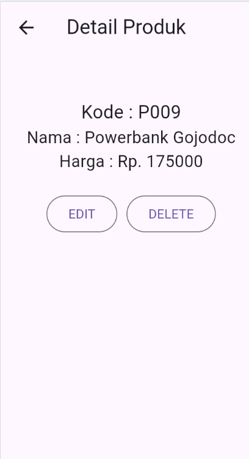|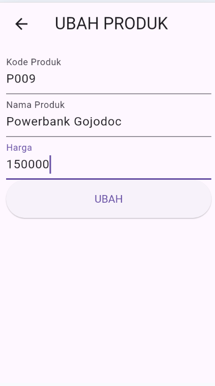|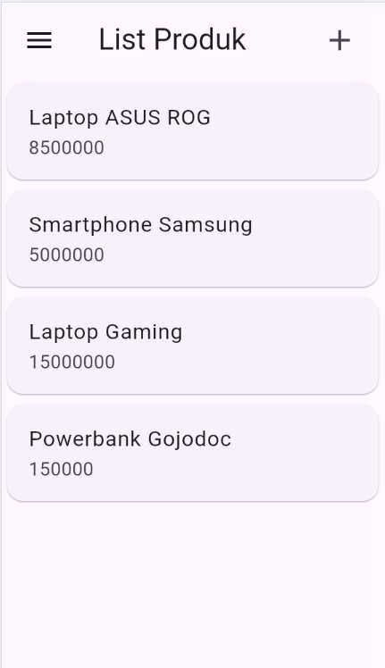|

Data produk yang dipilih diteruskan ke form edit. Form secara otomatis terisi dengan data lama. Setelah diedit, data dikirim ke endpoint /produk/{id} dengan metode PUT menggunakan jsonEncode() untuk konversi ke JSON string.

**Kode Mode Edit (`lib/ui/produk_form.dart`):**
```dart
isUpdate() {
  if (widget.produk != null) {
    setState(() {
      judul = "UBAH PRODUK";
      tombolSubmit = "UBAH";
      _kodeProdukTextboxController.text = widget.produk!.kodeProduk!;
      _namaProdukTextboxController.text = widget.produk!.namaProduk!;
      _hargaProdukTextboxController.text =
          widget.produk!.hargaProduk.toString();
    });
  }
}
```

**Kode BLoC Update (`lib/bloc/produk_bloc.dart`):**
```dart
static Future updateProduk({required Produk produk}) async {
  String apiUrl = ApiUrl.updateProduk(int.parse(produk.id!));

  var body = {
    "kode_produk": produk.kodeProduk,
    "nama_produk": produk.namaProduk,
    "harga": produk.hargaProduk.toString()
  };

  var response = await Api().put(apiUrl, jsonEncode(body));
  var jsonObj = json.decode(response.body);
  return jsonObj['status'];
}
```

#### **6. Delete Produk**
| Detail Produk    | Pop Up Delete          | List Produk     |
|--------------------------|----------------------------|----------------------------|
|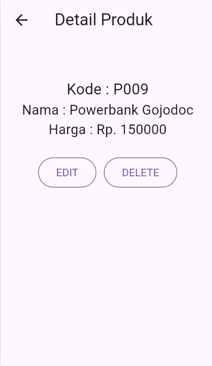|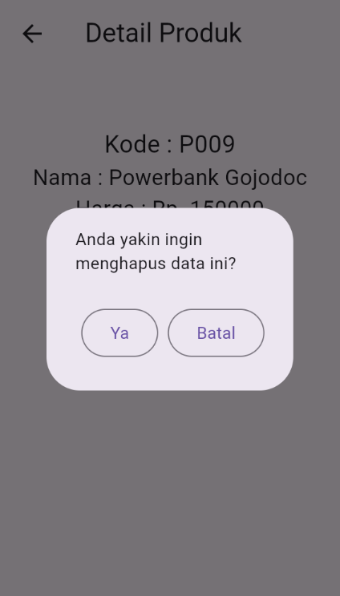|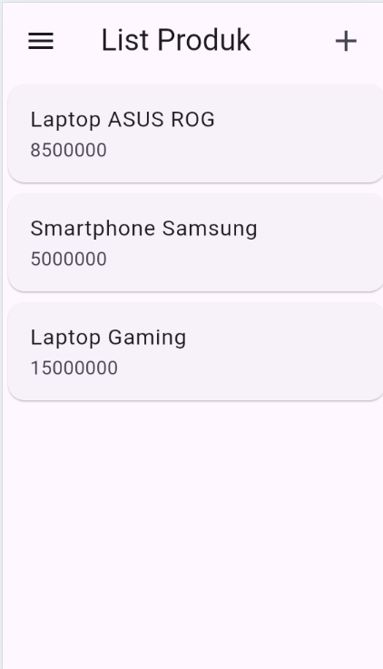|

Sebelum menghapus, muncul dialog konfirmasi. Jika disetujui, aplikasi mengirim request DELETE ke endpoint /produk/{id}. Setelah berhasil, halaman produk diperbarui untuk menghilangkan item yang dihapus.

**Kode Konfirmasi Hapus (`lib/ui/produk_detail.dart`):**
```dart
void confirmHapus() {
  AlertDialog alertDialog = AlertDialog(
    content: const Text("Anda yakin ingin menghapus data ini?"),
    actions: [
      OutlinedButton(
        child: const Text("Ya"),
        onPressed: () {
          ProdukBloc.deleteProduk(id: int.parse(widget.produk!.id!)).then(
            (value) => {
              Navigator.of(context).push(MaterialPageRoute(
                  builder: (context) => const ProdukPage()))
            }, onError: (error) {
              showDialog(
                context: context,
                builder: (BuildContext context) => const WarningDialog(
                  description: "Hapus data gagal, silahkan coba lagi",
                ),
              );
            });
        },
      ),
      OutlinedButton(
        child: const Text("Batal"),
        onPressed: () => Navigator.pop(context),
      )
    ],
  );

  showDialog(builder: (context) => alertDialog, context: context);
}
```

**Kode BLoC Delete:**
```dart
static Future<bool> deleteProduk({int? id}) async {
  String apiUrl = ApiUrl.deleteProduk(id!);
  var response = await Api().delete(apiUrl);
  var jsonObj = json.decode(response.body);
  return (jsonObj as Map<String, dynamic>)['data'];
}
```

#### **7. Logout**
| Navigasi    | Redirect ke login          |
|--------------------------|----------------------------|
|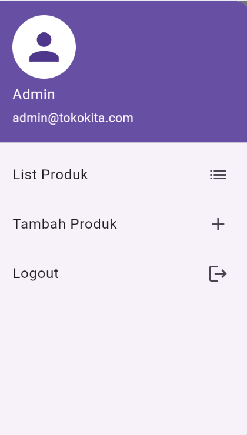||

Saat logout, semua data sesi dihapus dari SharedPreferences menggunakan metode clear(). Pengguna kemudian diarahkan ke halaman login dengan menghapus semua riwayat navigasi sebelumnya.

**Kode Logout (`lib/ui/produk_page.dart`):**
```dart
ListTile(
  title: const Text('Logout'),
  trailing: const Icon(Icons.logout),
  onTap: () async {
    await LogoutBloc.logout().then((value) => {
      Navigator.of(context).pushAndRemoveUntil(
        MaterialPageRoute(builder: (context) => LoginPage()),
        (route) => false)
    });
  },
),
```

**Kode Helper Logout (`lib/helpers/user_info.dart`):**
```dart
Future logout() async {
  final SharedPreferences pref = await SharedPreferences.getInstance();
  pref.clear();
}
```

## **Konfigurasi API**

```Dart
class ApiUrl {
  static const String baseUrl = 'http://192.168.56.1/toko-api/public';
  
  static const String registrasi = baseUrl + '/registrasi';
  static const String login = baseUrl + '/login';
  static const String listProduk = baseUrl + '/produk';
  static const String createProduk = baseUrl + '/produk';

  static String updateProduk(int id) {
    return baseUrl + '/produk/' + id.toString();
  }

  static String showProduk(int id) {
    return baseUrl + '/produk/' + id.toString();
  }

  static String deleteProduk(int id) {
    return baseUrl + '/produk/' + id.toString();
  }
}
```


